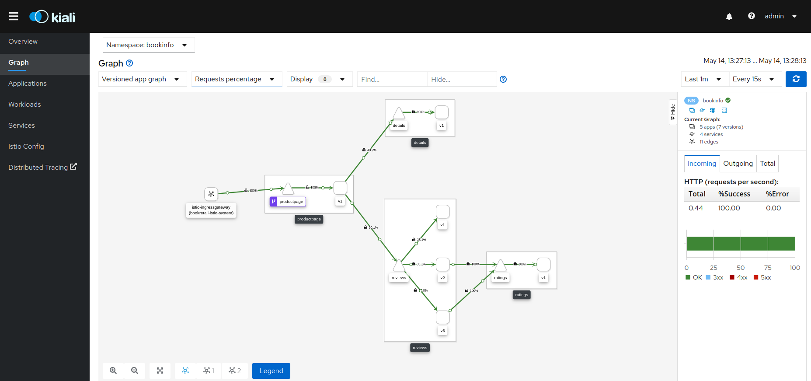

# Securing a Microservice Architecture with Red Hat OpenShift Service Mesh

This repos includes a set of scripts to secure a Microservices Architecture with
Red Hat OpenShift Service Mesh.

## Red Hat OpenShift Container Platform

To follow this repo it is needed to have access to a Red Hat OpenShift Container Platform 4.3 or higher
with ```cluster-admin``` privilegies.

To use locally, you could use [Red Hat CodeReady Containers](https://developers.redhat.com/products/codeready-containers). CRC brings a minimal, preconfigured OpenShift 4 or newer cluster to your local
laptop or desktop computer for development and testing purposes.

## Deploy Microservices Architecture

This repo will use the [Bookinfo Application](https://istio.io/docs/examples/bookinfo/) as
Microservices Architecture sample. This application deploys a set of microservices interconnected.

The application is available [here](https://github.com/istio/istio/tree/release-1.4/samples/bookinfo)

The script ```01-deploy-bookinfo.sh``` deploys the application into the ```bookinfo``` namespace.

Sample output of this script:

```bash
$ ./01-deploy-bookinfo.sh
Create bookinfo project
Now using project "bookinfo" on server "https://api.cluster-8096.8096.sandbox960.opentlc.com:6443".

You can add applications to this project with the 'new-app' command. For example, try:

    oc new-app django-psql-example

to build a new example application in Python. Or use kubectl to deploy a simple Kubernetes application:

    kubectl create deployment hello-node --image=gcr.io/hello-minikube-zero-install/hello-node

Deploy Bookinfo objects
service/details created
serviceaccount/bookinfo-details created
deployment.apps/details-v1 created
service/ratings created
serviceaccount/bookinfo-ratings created
deployment.apps/ratings-v1 created
service/reviews created
serviceaccount/bookinfo-reviews created
deployment.apps/reviews-v1 created
deployment.apps/reviews-v2 created
deployment.apps/reviews-v3 created
service/productpage created
serviceaccount/bookinfo-productpage created
deployment.apps/productpage-v1 created
Expose Product Page route
route.route.openshift.io/productpage exposed

Product Page: http://productpage-bookinfo.apps.cluster-8096.8096.sandbox960.opentlc.com
```

After some minutes the application will be deployed. To check the pod's statuses:

```bash
$ oc get pod -n bookinfo
NAME                              READY   STATUS    RESTARTS   AGE
details-v1-78d78fbddf-4xxsr       1/1     Running   0          9m56s
productpage-v1-596598f447-kpmr5   1/1     Running   0          9m54s
ratings-v1-6c9dbf6b45-ww2xn       1/1     Running   0          9m56s
reviews-v1-7bb8ffd9b6-8gddc       1/1     Running   0          9m55s
reviews-v2-d7d75fff8-h7cfm        1/1     Running   0          9m55s
reviews-v3-68964bc4c8-6jzm2       1/1     Running   0          9m55s
```

This application could be tested (in a insecured way) as:

```bash
while :; do curl -k -s -w %{http_code} --output /dev/null http://$(oc get route productpage --template '{{ .spec.host }}' -n bookinfo)/productpage?u=normal; echo "";sleep 1; done
```

## Deploy Red Hat OpenShift Service Mesh

Red Hat OpenShift Service Mesh deployment requires to deploy a set of Kubernetes operators:

* ElasticSearch Operator
* Jaeger Operator
* Kiali Operator
* Red Hat OpenShift Service Mesh Operator

Red Hat OpenShift Service Mesh Operator will manage the Control Plane used for this application. This
Control Plane will be deployed in the ```bookretail-istio-system``` namespace.

The script ```02-deploy-sm.sh``` deploys our Service Mesh.

Sample output of this script:

```bash
$ ./02-deploy-sm
Deploy ElasticSearch Operator
subscription.operators.coreos.com/elasticsearch-operator created
elasticsearch-operator.4.4.0-202004261927   Elasticsearch Operator   4.4.0-202004261927              Pending
No resources found in openshift-operators namespace.
Deploy Jaeger Operator
subscription.operators.coreos.com/jaeger-product created
jaeger-operator.v1.17.2                     Red Hat OpenShift Jaeger   1.17.2                          Succeeded
jaeger-operator-b8fd89b48-52j48   1/1     Running   0          57s
Deploy Kiali Operator
subscription.operators.coreos.com/kiali-ossm created
kiali-operator.v1.12.11                     Kiali Operator             1.12.11              kiali-operator.v1.12.7   
kiali-operator-5fd5c849b9-kmdfc   2/2     Running   0          55s
Deploy Service Mesh Operator 
subscription.operators.coreos.com/servicemeshoperator created
Create Service Mesh Control Plane namespace for Bookinfo application
Created project bookretail-istio-system
Deploy Service Mesh Control Plane
servicemeshcontrolplane.maistra.io/service-mesh-installation created
Watch pod status
NAME                            READY   STATUS              RESTARTS   AGE
istio-citadel-7bd788bdf-d4h8f   1/1     Running             0          58s
prometheus-7bdbff757f-h7n6n     0/2     ContainerCreating   0          15s
```

After some minutes (around 10 or more) the following pods will be deployed:

```bash
$ oc get pods -n bookretail-istio-system
NAME                                      READY   STATUS    RESTARTS   AGE
grafana-6777cbf6d6-d26c8                  2/2     Running   0          4m47s
istio-citadel-7bd788bdf-d4h8f             1/1     Running   0          8m4s
istio-egressgateway-85dc459cc5-bsfgw      1/1     Running   0          5m41s
istio-galley-85db4cdf4d-kdctk             1/1     Running   0          6m44s
istio-ingressgateway-dd47477b5-qvfrv      1/1     Running   0          5m41s
istio-pilot-6567df54f6-9lp74              2/2     Running   0          5m41s
istio-policy-554d9cf89-d2qnz              2/2     Running   0          6m21s
istio-sidecar-injector-78c97dfd7d-qrtmz   1/1     Running   0          5m8s
istio-telemetry-6d7dc6694d-dxrmt          2/2     Running   0          6m21s
jaeger-7bbd8fb8bb-vdxxn                   2/2     Running   0          6m44s
kiali-b5464dbf8-g2w24                     1/1     Running   0          3m50s
prometheus-7bdbff757f-h7n6n               2/2     Running   0          7m21s
```

References:

* [Installing Red Hat OpenShift Service Mesh](https://docs.openshift.com/container-platform/4.3/service_mesh/service_mesh_install/installing-ossm.html#installing-ossm)
* [Understanding Red Hat OpenShift Service Mesh](https://docs.openshift.com/container-platform/4.3/service_mesh/service_mesh_arch/understanding-ossm.html)

## Deploy Service Mesh Member Roll

Service Mesh Member Roll will manage a set of namespaces for our Service Mesh platform. The Service
Mesh Member Roll will manage the namespaces identified to inject the istio-proxy containers and
to manage and observe the network traffic.

The script ```03-deploy-sm-memberroll.sh``` will execute the following task:

* Deploy Data Plane reference
* Inject istio-proxy containers for each deployment
* Expose application to be used by ingress gateway

Sample output

```bash
$ ./03-deploy-sm-memberroll.sh
Deploy Service Mesh Member Roll for bookinfo namespace
servicemeshmemberroll.maistra.io/default created
Checking Service Mesh labels in bookinfo namespace


map[maistra.io/member-of:bookretail-istio-system]

Adding sidecar.istio.io/inject annotation in deployments

Patching details-v1
deployment.extensions/details-v1 patched
Checking details-v1 pods

counter    replicas    readyReplicas
1          2           1
2          2           1
3          2           1
4          2           1
5          2           1
6          2           1
7          2           1
8          1           1

Patching productpage-v1
deployment.extensions/productpage-v1 patched
Checking productpage-v1 pods

counter    replicas    readyReplicas
1          2           1
2          2           1
3          2           1
4          2           1
5          2           1
6          2           1
7          1           1

Patching ratings-v1
deployment.extensions/ratings-v1 patched
Checking ratings-v1 pods

counter    replicas    readyReplicas
1          2           1
2          2           1
3          2           1
4          2           1
5          2           1
6          2           1
7          2           1
8          1           1

Patching reviews-v1
deployment.extensions/reviews-v1 patched
Checking reviews-v1 pods

counter    replicas    readyReplicas
1          2           1
2          2           1
3          2           1
4          2           1
5          2           1
6          2           1
7          2           1
8          1           1

Patching reviews-v2
deployment.extensions/reviews-v2 patched
Checking reviews-v2 pods

counter    replicas    readyReplicas
1          2           1
2          2           1
3          2           1
4          2           1
5          2           1
6          2           1
7          2           1
8          1           1

Patching reviews-v3
deployment.extensions/reviews-v3 patched
Checking reviews-v3 pods

counter    replicas    readyReplicas
1          2           1
2          2           1
3          2           1
4          2           1
5          2           1
6          2           1
7          2           1
8          2           1
9          2           1
10          2           1
11          2           1
12          2           1
13          2           1
14          2           1
15          2           1
16          2           1
17          1           1

Patching Product Page application to be exposed by Service Mesh
deployment.extensions/productpage-v1 patched

Checking number of containers in pods
details-v1-6657b8bdf-ktdbb    :		details istio-proxy
productpage-v1-597b74b4c-f9brx    :		productpage istio-proxy
productpage-v1-7d85c9b477-xtsj9    :		productpage istio-proxy
ratings-v1-66cddbfb8f-578k2    :		ratings istio-proxy
reviews-v1-6788566f98-jl9dp    :		reviews istio-proxy
reviews-v2-7c4bffdcc4-pwgn7    :		reviews istio-proxy
reviews-v2-d7d75fff8-h7cfm    :		reviews
reviews-v3-68964bc4c8-6jzm2    :		reviews
reviews-v3-69b6d8786-ws6b5    :		reviews istio-proxy
```

## Enable Security communications

We will use our self-signed certificate to expose our application and also to
enable the mTLS communications between each microservice.

**WARNING**: Before to execute this step, please review the ```cert.cfg```, ```04-install-sm-certs.sh``` and
```05-deploy-sm-mtls.sh``` to update the following variables which identify your OCP endpoints:

To review in ```cert.cfg``` file:

```txt
[req_distinguished_name]
commonName=TBD

[req_ext]
subjectAltName   = @alt_names

[alt_names]
DNS.1  = .TBD
DNS.2  = *.TBD
```

To review in ```04-install-sm-certs.sh``` file:

* ```hosts``` attribute in the ```Gateway``` definition

To review in ```05-deploy-sm-mtls.sh``` file: 

* ```hosts``` attribute in the ```VirtualService``` and ```Route``` definition

Sample output of ```04-install-sm-certs.sh```:

```bash
$ ./04-install-sm-certs.sh

Create a self-signed certificate and private key
Generating a RSA private key
.......................+++++
...................+++++
writing new private key to 'tls.key'
-----

Create a secret named istio-ingressgateway-certs in the service mesh control plane namespace with the certificates
secret/istio-ingressgateway-certs created

Restart the Istio ingress gateway
deployment.extensions/istio-ingressgateway patched

Create a file called wildcard-gateway.yml with the definition of the wildcard gateway
gateway.networking.istio.io/bookretail-wildcard-gateway created
```

The script ```05-deploy-sm-mtls.sh``` deploys the Service Mesh objects to enable mTLS communications
between each microservice and expose a secure endpoint to used outside OpenShift.

Sample output

```bash
$ ./05-deploy-sm-mtls.sh
Create Policy object for bookinfo deployments

Create Policy for details-v1
policy.authentication.istio.io/details-v1-mtls-policy created

Create Policy for productpage-v1
policy.authentication.istio.io/productpage-v1-mtls-policy created

Create Policy for ratings-v1
policy.authentication.istio.io/ratings-v1-mtls-policy created

Create Policy for reviews-v1
policy.authentication.istio.io/reviews-v1-mtls-policy created

Create Policy for reviews-v2
policy.authentication.istio.io/reviews-v2-mtls-policy created

Create Policy for reviews-v3
policy.authentication.istio.io/reviews-v3-mtls-policy created

Create Destination Rules for bookinfo services

Create DestinationRule for details
destinationrule.networking.istio.io/details-mtls-destinationrule created

Create DestinationRule for productpage
destinationrule.networking.istio.io/productpage-mtls-destinationrule created

Create DestinationRule for ratings
destinationrule.networking.istio.io/ratings-mtls-destinationrule created

Create DestinationRule for reviews
destinationrule.networking.istio.io/reviews-mtls-destinationrule created
virtualservice.networking.istio.io/productpage-virtualservice created
route.route.openshift.io/productpage-gateway created
Deleting insecure route
route.route.openshift.io "productpage" deleted
```

## Observability

This application could be tested (in a insecured way) as:

```bash
while :; do curl -k -s -w %{http_code} --output /dev/null https://$(oc get route productpage-gateway --template '{{ .spec.host }}' -n bookretail-istio-system)/productpage?u=normal; echo "";sleep 1; done
```

If you want to analize how your Microservice Architecture is working, Kiali will give you
the observability easily.

Open a browser to navigate to Kiali available from the following route:

```bash
oc get route kiali --template '{{ .spec.host }}
```

If everthing was fine, you could see your secured microservices architecture in a graph similar to the
next one:


